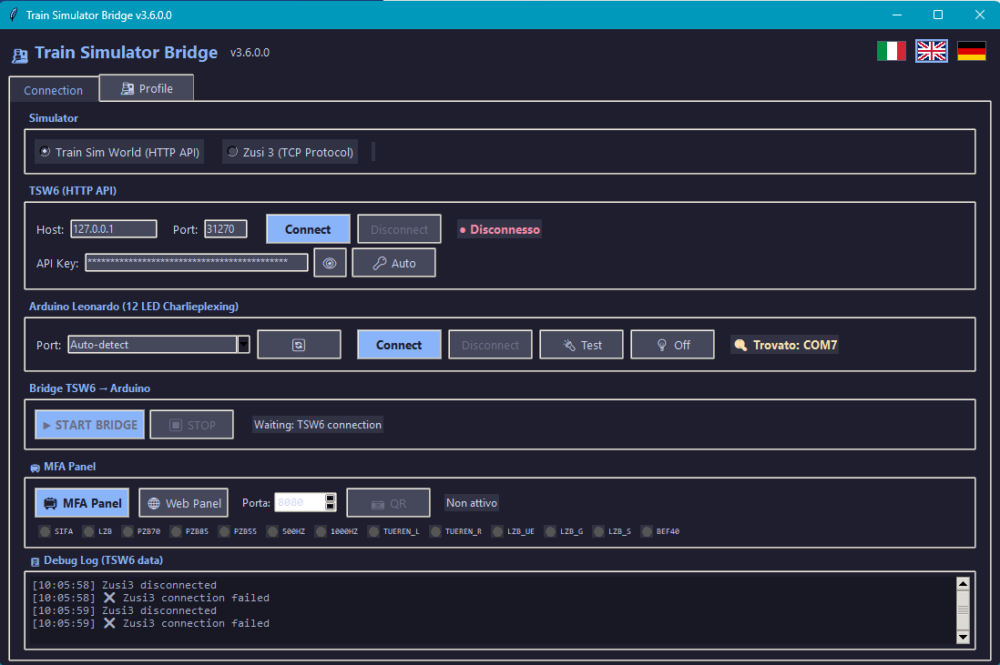
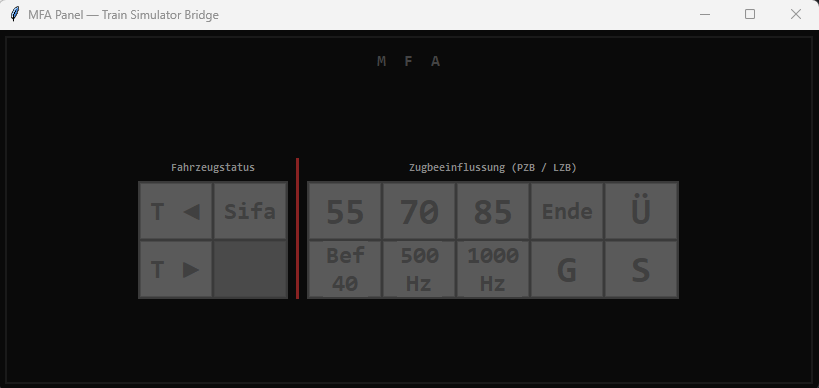
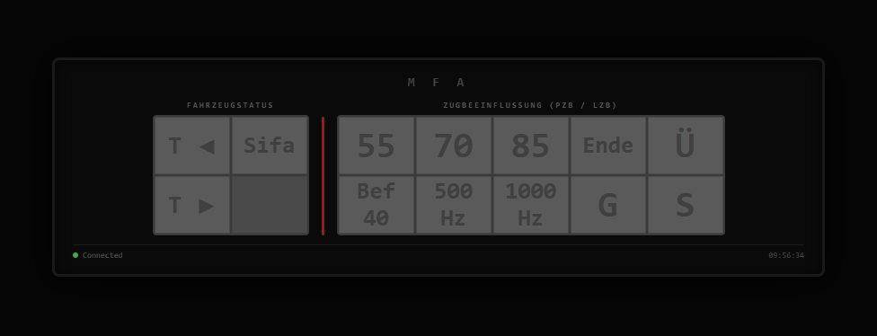
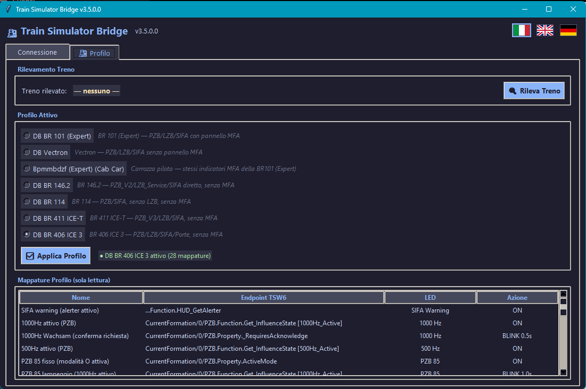

# 🚂 Train Simulator Bridge

[🇬🇧 English](README.md) | [🇮🇹 Italiano](README.it.md) | 🇩🇪 **Deutsch**

**Physische Nachbildung der MFA-Anzeige** eines deutschen Zuges (PZB / SIFA / LZB) mit einem Arduino Leonardo und 13 LEDs über MAX7219-Treiber (3 Pins), gesteuert in Echtzeit durch **Train Sim World 6** oder **Zusi 3**.


[](https://github.com/Giako888/bridge-trainsimworld-zusi3-arduino/releases/latest)
[](https://github.com/Giako888/bridge-trainsimworld-zusi3-arduino/releases/latest)

---

## Screenshots

| Haupt-GUI | MFA-Popup | Web-Panel | Profil-Tab |
|:---------:|:---------:|:---------:|:----------:|
|  |  |  |  |

## Übersicht

```
┌──────────────┐    HTTP / TCP    ┌──────────────────┐    Seriell   ┌─────────────────┐
│  Train Sim   │ ──────────────> │  Train Simulator │ ──────────> │  Arduino        │
│  World 6     │   Port 31270    │  Bridge (Python) │  115200 Bd  │  Leonardo       │
│  oder        │   Port 1436     │                  │             │  13 LEDs (MFA)  │
│  Zusi 3      │                 │  Tkinter-GUI     │             │  MAX7219-LEDs   │
└──────────────┘                 └──────────────────┘             └─────────────────┘
```

Die Anwendung liest Echtzeitdaten aus einem Zugsimulator und steuert 13 physische LEDs, die die **MFA** (Multifunktionale Anzeige) im Führerstands deutscher Lokomotiven nachbilden.

## Funktionen

- **Zwei Simulatoren**: Unterstützung für TSW6 (HTTP-API) und Zusi 3 (binäres TCP-Protokoll)
- **TSW6**: 7 Zugprofile mit spezifischen Endpunkt-Zuordnungen (DB BR 101 Expert, Vectron, Bpmmbdzf Expert, BR 146.2, BR 114, BR 411 ICE-T, BR 406 ICE 3)
- **Zusi 3**: funktioniert mit den meisten Zügen — LED-Daten kommen über generisches TCP-Protokoll
- **SimRail** (geplant): Unterstützung wird hinzugefügt, sobald offizielle I/O-APIs für die Führerstand-Instrumentierung veröffentlicht werden
- **Automatische Erkennung** (TSW6): erkennt die aktive Lokomotive und lädt das passende LED-Profil
- **13 physische LEDs**: PZB (55/70/85, 500Hz, 1000Hz), SIFA, LZB (Ende, Ü, G, S), Türen (L/R), Befehl 40
- **Realistische LED-Steuerung**: Prioritätslogik mit Dauerlicht, variablem Blinken, PZB 70↔85 Wechselblinken
- **MFA-Web-Panel**: Browser-basierte LED-Anzeige für Tablet / Smartphone im lokalen Netzwerk
- **QR-Code**: Ein-Klick-QR-Code für einfache Tablet-Verbindung zum Web-Panel
- **Mehrsprachige GUI**: Italienisch, Englisch, Deutsch — erkennt die Systemsprache automatisch, umschaltbar mit Flaggen-Icons
- **Moderne GUI**: Dark-Theme-Oberfläche mit Echtzeit-LED-Vorschau
- **Standalone-EXE**: mit PyInstaller erstellbar, keine Python-Installation erforderlich

## MFA-Anzeige — 13 LEDs

| # | LED | Funktion |
|---|-----|----------|
| 1 | **SIFA** | Sicherheitsfahrschaltung |
| 2 | **LZB** | Linienzugbeeinflussung Ende |
| 3 | **PZB 70** | PZB Zugart M (70 km/h) |
| 4 | **PZB 85** | PZB Zugart O (85 km/h) |
| 5 | **PZB 55** | PZB Zugart U (55 km/h) |
| 6 | **500 Hz** | PZB 500-Hz-Beeinflussung |
| 7 | **1000 Hz** | PZB 1000-Hz-Beeinflussung |
| 8 | **Türen L** | Türen links entriegelt |
| 9 | **Türen R** | Türen rechts entriegelt |
| 10 | **LZB Ü** | LZB Überwachung |
| 11 | **LZB G** | LZB aktiv (Geführt) |
| 12 | **LZB S** | LZB Zwangsbremsung |
| 13 | **Befehl 40** | Befehl 40 km/h |

## Voraussetzungen

### Software
- **Python 3.13+** (oder die vorkompilierte EXE verwenden)
- **Windows 10/11**
- **Train Sim World 6** mit aktivierter External Interface API (siehe [TSW6 einrichten](#tsw6-einrichten)), oder **Zusi 3**

### Hardware
- **Arduino Leonardo** (ATmega32U4)
- 13 LEDs gesteuert durch **MAX7219**-Modul (3 Pins)
- Siehe [Arduino-Firmware](#arduino-firmware) für zwei Firmware-Optionen

## Installation

### Aus Quellcode

```bash
git clone https://github.com/Giako888/bridge-trainsim-arduino.git
cd bridge-trainsim-arduino
pip install -r requirements.txt
python tsw6_arduino_gui.py
```

### EXE erstellen

```bash
python -m PyInstaller TSW6_Arduino_Bridge.spec --noconfirm
# Ausgabe: dist/TrainSimBridge.exe
```

## TSW6 einrichten

### 1. HTTP API aktivieren

Die External Interface API von TSW6 ist **standardmäßig deaktiviert**. Du musst den Startparameter `-HTTPAPI` hinzufügen:

<details>
<summary><b>Steam</b></summary>

1. Öffne **Steam** → **Bibliothek**
2. Rechtsklick auf **Train Sim World 6** → **Eigenschaften**
3. Im Tab **Allgemein** den Bereich **Startoptionen** finden
4. Eingeben:
   ```
   -HTTPAPI
   ```
5. Fenster schließen — die Einstellung wird automatisch gespeichert

</details>

<details>
<summary><b>Epic Games</b></summary>

1. Öffne den **Epic Games Launcher** → **Bibliothek**
2. Klicke auf die **drei Punkte (⋯)** bei Train Sim World 6 → **Verwalten**
3. Haken bei **Zusätzliche Befehlszeilenargumente**
4. Eingeben:
   ```
   -HTTPAPI
   ```
5. Fenster schließen

</details>

### 2. TSW6 starten & API-Schlüssel erzeugen

1. **Train Sim World 6** starten (mit aktivem `-HTTPAPI`)
2. Das Spiel erzeugt automatisch die API-Schlüsseldatei unter:
   ```
   %USERPROFILE%\Documents\My Games\TrainSimWorld6\Saved\Config\CommAPIKey.txt
   ```
   > **Hinweis:** Diese Datei wird erst nach dem ersten Start mit `-HTTPAPI` erstellt.

### 3. Train Simulator Bridge verbinden

1. **Train Simulator Bridge** öffnen, **TSW6** auswählen und **Verbinden** klicken
2. Der API-Schlüssel wird automatisch gelesen — keine manuelle Konfiguration nötig
3. Der Zug wird automatisch erkannt und das LED-Profil geladen

## Zusi 3 einrichten

1. **Zusi 3** mit aktivierter TCP-Schnittstelle starten (Port 1436)
2. In Train Simulator Bridge **Zusi3** auswählen und **Verbinden** klicken
3. LED-Daten werden über ein generisches TCP-Protokoll empfangen — **funktioniert mit den meisten Zügen**, keine zugspezifischen Profile nötig

## Unterstützte Züge

### TSW6 — Spezifische Profile erforderlich

Jeder TSW6-Zug benötigt ein eigenes Profil mit individuellen API-Endpunkt-Zuordnungen. Derzeit werden nur folgende Züge unterstützt:

| Zug | PZB | LZB | SIFA | Hinweise |
|-----|-----|-----|------|----------|
| **DB BR 101 (Expert)** | PZB_V3 | LZB | BP_Sifa_Service | Vollständige MFA-Anzeige |
| **Siemens Vectron** | PZB_Service_V3 | LZB_Service | BP_Sifa_Service | Ohne MFA |
| **Bpmmbdzf (Expert)** | — | — | — | Steuerwagen (gleiche Endpunkte wie BR101 Expert) |
| **DB BR 146.2** | PZB_Service_V2 | LZB_Service | SIFA | 26 Zuordnungen, realistisches PZB 90 |
| **DB BR 114** | PZB | — | BP_Sifa_Service | Ohne LZB, beide Kabinen (F/B) |
| **DB BR 411 ICE-T** | PZB_Service_V3 | LZB | BP_Sifa_Service | Neigetechnik-Zug, ohne MFA |
| **DB BR 406 ICE 3** | PZB | LZB | IsSifaInEmergency | ICE 3M, partielle Schlüssel-Zuordnung |

> Weitere TSW6-Züge werden in zukünftigen Versionen hinzugefügt. — Die meisten Züge werden unterstützt

Zusi 3 liefert Führerstand-Instrumentendaten über ein generisches TCP-Protokoll (Fahrpult-Nachricht). Die LED-Anzeige funktioniert mit **den meisten Zügen**, die PZB-/SIFA-/LZB-Daten bereitstellen — ohne zugspezifische Profile.

## Arduino-Firmware

Zwei Firmware-Versionen stehen zur Verfügung, beide **100% kompatibel** mit Train Simulator Bridge (gleiches serielles Protokoll):

| | **ArduinoSerialOnly** | **ArduinoJoystick** |
|---|---|---|
| Zweck | Nur LED-Anzeige (MFA) | LED-Anzeige + vollständiger Joystick-Controller |
| Bauteile | ~16 (Arduino + 13 LEDs + 13 Widerstände) | 70+ (LEDs + Schieber + Encoder + Schalter + Dioden) |
| Verwendete Pins | 5 (A3, 0, 1, A4, 14/MISO) | Alle 20 Pins + Pin 14 (ICSP) |
| Bibliotheken | Keine | Joystick + Encoder |
| Schwierigkeit | Einfach | Fortgeschritten |

Siehe [ARDUINO_FIRMWARE.md](ARDUINO_FIRMWARE.md) für vollständige Details, Verkabelungsanleitung und Bauteil-Liste.
Auch verfügbar auf: [English](ARDUINO_FIRMWARE_EN.md) | [Italiano](ARDUINO_FIRMWARE.md)

> **💡 Tipp für die Joystick-Version:** um den Arduino-Joystick in TSW6 einzurichten, schau dir [TSW Controller App](https://github.com/LiamMartens/tsw-controller-app) an — ein hervorragendes Tool zum Zuordnen von Controller-Achsen und -Tasten.

## Projektstruktur

```
├── tsw6_arduino_gui.py        # Haupt-GUI (Tkinter)
├── led_panel.py               # MFA-LED-Panel (Tkinter-Popup + Webserver)
├── i18n.py                    # Übersetzungen (IT/EN/DE)
├── tsw6_api.py                # TSW6-HTTP-API-Client
├── config_models.py           # Datenmodelle, Profile, Bedingungen
├── arduino_bridge.py          # Serielle Arduino-Kommunikation
├── zusi3_client.py            # Zusi-3-TCP-Client
├── zusi3_protocol.py          # Zusi-3-Binärprotokoll-Parser
├── TSW6_Arduino_Bridge.spec   # PyInstaller-Spec-Datei
├── requirements.txt           # Python-Abhängigkeiten
├── ARDUINO_FIRMWARE.md        # Arduino-Firmware-Anleitung (IT)
├── ARDUINO_FIRMWARE_EN.md     # Arduino-Firmware-Anleitung (EN)
├── ARDUINO_FIRMWARE_DE.md     # Arduino-Firmware-Anleitung (DE)
├── ArduinoSerialOnly/         # Firmware: nur serielle LEDs (einfach)
│   ├── ArduinoSerialOnly.ino
│   └── WIRING.h
├── ArduinoJoystick/           # Firmware: LED + Joystick (vollständig)
│   ├── ArduinoJoystick.ino
│   └── WIRING.h
├── tsw6_bridge.ico            # Anwendungssymbol
└── COPILOT_CONTEXT.md         # Vollständiger Kontext für GitHub Copilot
```

## LED-Prioritätslogik

Jede LED kann mehrere Zuordnungen mit einer **numerischen Priorität** haben. Die Zuordnung mit der höchsten Priorität und erfüllter Bedingung gewinnt:

| Priorität | Wirkung | Beispiel |
|-----------|---------|----------|
| 0 | Dauerlicht | Aktive PZB-Zugart |
| 1 | Blinken 1,0s | Frequenzüberwachung |
| 3 | Blinken 1,0s | Restriktiv (Wechselblinken) |
| 4 | Blinken 0,5s | Geschwindigkeitsüberschreitung |
| 5 | Blinken 0,3s | Zwangsbremsung |

### Wechselblinken (PZB 90)

Im **restriktiven** Modus blinken die LEDs PZB 70 und PZB 85 gegenphasig (*Wechselblinken*), genau wie beim realen PZB 90:

> *"Wird eine 1000- oder 500-Hz-Beeinflussung restriktiv, so wird dies durch Wechselblinken der Zugart-Leuchtmelder 70 und 85 angezeigt."*
> — Wikipedia, Punktförmige Zugbeeinflussung

## Lizenz

Dieses Werk ist lizenziert unter einer [Creative Commons Namensnennung - Nicht kommerziell 4.0 International Lizenz](https://creativecommons.org/licenses/by-nc/4.0/deed.de).

Sie dürfen dieses Werk für nicht-kommerzielle Zwecke teilen und bearbeiten, mit angemessener Namensnennung. Siehe [LICENSE](LICENSE) für Details.
